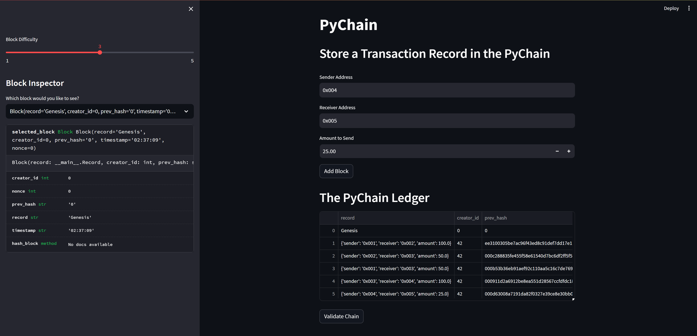
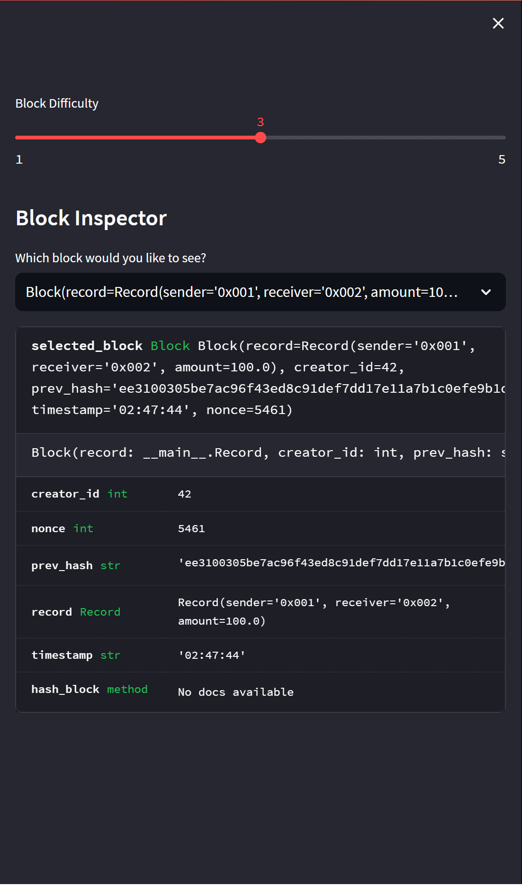
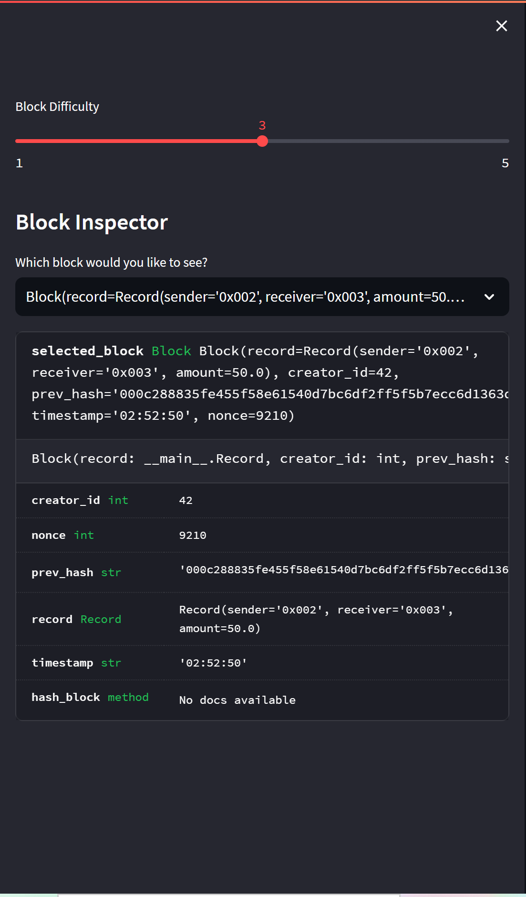
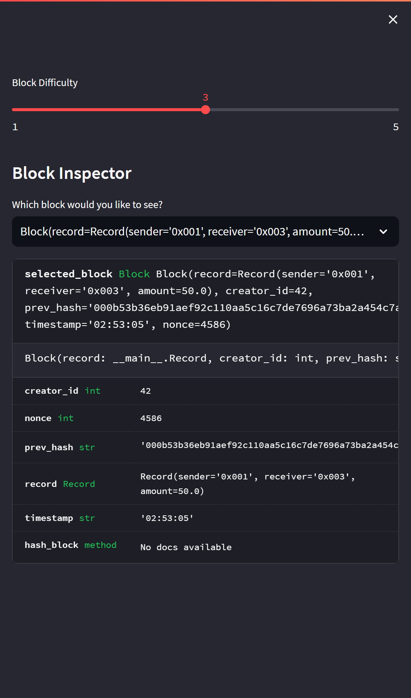
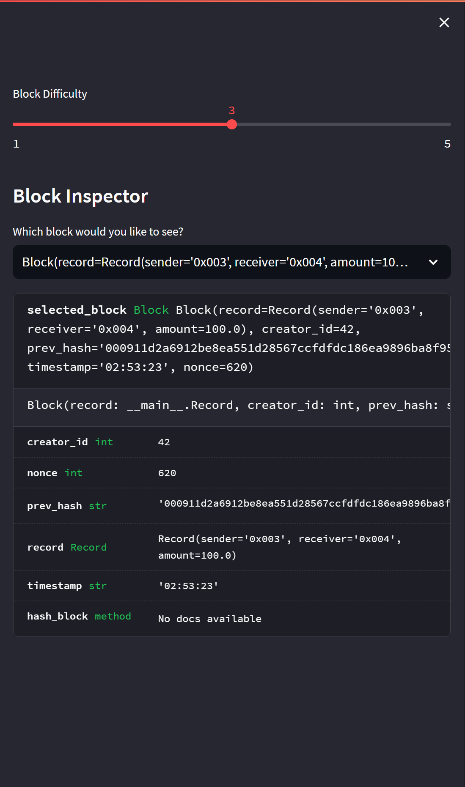
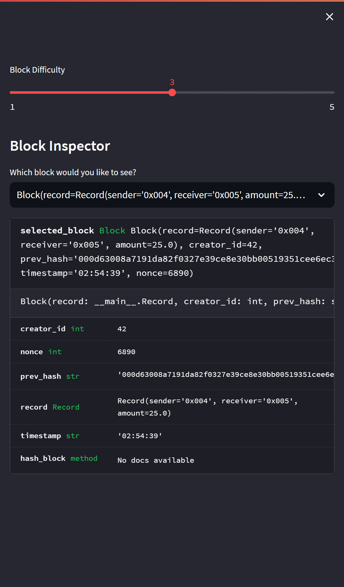
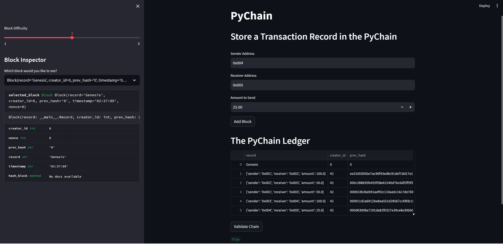

# Blockchain: PyChain Ledger
The aim of this project is to build a blockchain-based ledger system for banks to conduct financial transactions with a simple to use web interface.

## About
Decentralized finance is the new way to conduct financial transactions without the need for a itermediary body such as a bank. By using a blockchain-based ledger system, financial transactions can be conducted with the ability for the data to be verified at anytime in the ledger. This includes the sender, receiver, amount and time of the transactions. Due to the nature of the blockchain any transactions that has been hashed to a block cannot by changed or overwritten. This ensures the integrity of all the data stored in the ledger.

## Getting Started
To run the Jupyter notebook and interact with the visualizations, you need to have the following software and Python libraries installed:

- Python 3.10 or later
- Streamlit

## Installing
1. Install the latest verion of Python [here](https://www.python.org/downloads/).

2. To install the Streamlit packages, run the following command in your terminal.

```
pip install Streamlit
```

## Usage
You can clone or download this GitHub project and open the `pychain.py` using any IDE of your choice, one being Visual Studio Code. In the terminal, navigate to the folder that the `pychain.py` file is located. Run the streamlit application by running the following command. 

```
streamlit run pychain.py
```

Values for the sender, receiver and amount can be entered before clicking "Add Block" to add the transaction to the ledger.

The blockchain and transactions can then later be verified by clicking the "Validate Chain" button.

# Report
## Testing the Web Application

### Adding Blocks to the Ledger

Add 5 new blocks to the ledger with transactions between 5 addresses.

<center>
    
</center>

### Verifying the Block Contents and Hashes

| | | |
|:--:|:--:|:--:|
|*Verify Block 1*|*Verify Block 2*|*Verify Block 3*|

| | |
|:--:|:--:|
|*Verify Block 4*|*Verify Block 5*|

### Validating the Chain on the Ledger

Validate the integrity of the chain.

<center>
    
</center>

## Contributor
Andy Vu